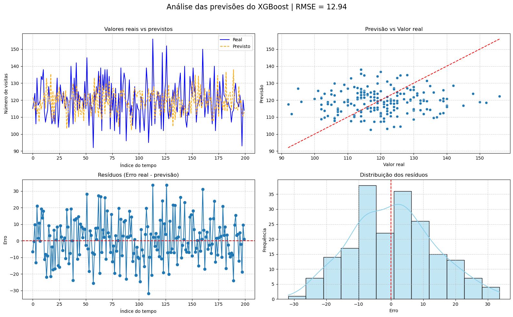
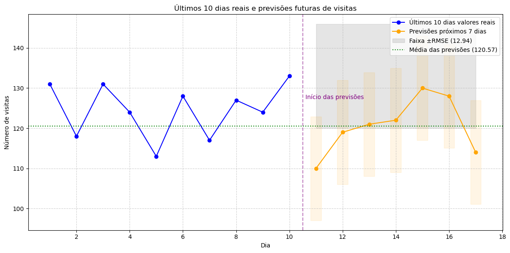

# 🌐 Previsão de Tráfego Web com Séries Temporais

Este projeto utiliza **modelagem com XGBoost** para prever o volume de visitas diarias em um site. O objetivo é estimar a quantidade de acessos futuros, fornecendo insights para o planejamento de marketing e infraestrutura.

---

## 🚀 Objetivos

- Construir um pipeline de dados utilizando PySpark para manipulação e feature engineering de séries temporais.
- Treinar um modelo de regressão com **XGBoost**, usando lags como preditores para capturar dependências temporais.
- Prever o número de visitas mensais ao site para períodos futuros.

---

## 🗂️ Dados

- **Fonte:** Dados simulados para fins didáticos.
- **Período:** Diario.
- **Variáveis principais:**
  - `Visits`: número total de visitas no mês.

---

## 🔍 Metodologia

### 🛠️ Pipeline do projeto
- **PySpark:** 
  - Leitura dos dados CSV e conversão em DataFrame Spark.
  - Conversão da coluna `Date` para tipo data e ordenação.
  - Criação de variáveis de defasagem (lags de 1, 2 e 3 períodos).
  - Remoção de linhas com valores nulos gerados pelos lags.

- **Preparação para modelagem:**
  - Conversão do Spark DataFrame final para pandas DataFrame.
  - Separação entre conjuntos de treino e previsão.

- **Modelagem com XGBoost:**
  - Treinamento do modelo `XGBRegressor` utilizando os lags como features.
  - Previsão do número de visitas para um horizonte futuro.

- **Exportação do modelo:**
  - Serialização do modelo treinado com `joblib` para reutilização.

---

## 📈 Resultados

- Foram geradas previsões mensais do tráfego web para o horizonte desejado, demonstrando a capacidade do modelo de capturar a dinâmica temporal.
- O modelo e o pipeline permitem facilmente atualizar previsões com novos dados históricos.


---

## 📚 Tecnologias e bibliotecas utilizadas

- **PySpark**: para manipulação e engenharia de dados em larga escala.
- **pandas & numpy**: apoio no tratamento final dos dados.
- **XGBoost (XGBRegressor)**: algoritmo de boosting para regressão.
- **joblib**: para salvar e carregar o modelo treinado.
- **matplotlib**: visualizações simples do forecast.

---

## ⚙️ Como executar

1. Clone o repositório:
   ```bash
   git clone https://github.com/jaquelinesfernandes/Predicting_WebTraficc_TimeSeries.git


✍️ Autora
|          [Jaqueline Fernandes](https://github.com/jaquelinesfernandes)          |
