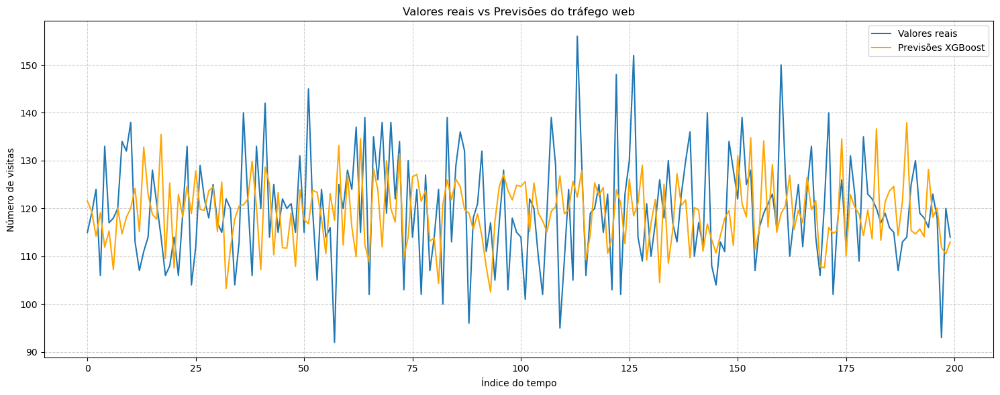

# 🌐 Previsão de Tráfego Web com Séries Temporais

Este projeto utiliza **modelagem com XGBoost** para prever o volume de visitas diarias em um site. O objetivo é estimar a quantidade de acessos futuros, fornecendo insights para o planejamento de marketing e infraestrutura.

---

## 🚀 Objetivos

- Construir um pipeline de dados utilizando Python para manipulação e feature engineering de séries temporais.
- Treinar um modelo de regressão com **XGBoost**, usando lags como preditores para capturar dependências temporais.
- Prever o número de visitas diárias ao site para períodos futuros.

---

## 🗂️ Dados

- **Fonte:** Dados simulados para fins didáticos.
- **Período:** Diario.
- **Variáveis principais:**
  - `Visits`: número total de visitas no mês.

---

## 🔍 Metodologia

### 🛠️ Análise Exploratória do projeto
  - Conversão do CSV em DataFrame final para pandas DataFrame.
  - Análise de Distribuição dos Dados, Taxa Média de Conversão, Verificação da Relação de Dia e Campanhas com o número de visitas. 
  - Análise de Correlação entre as variáveis.
  - Teste de Estacionariedade e Médias Móveis.

### 🛠️ Pipeline do projeto
- **Preparação para modelagem:**
  - Conversão do CSV em DataFrame final para pandas DataFrame.
  - Criação de variáveis de defasagem (lags de 1, 2 e 3 períodos).
  - Remoção de linhas com valores nulos gerados pelos lags.
  - Featuring Engineering para criação de variáveis para análise.
  - Pre-processamento dos dados com sklearn ColumTransform.
  - Separação entre conjuntos de treino e previsão com sklearn train_test_split.

- **Modelagem com XGBoost:**
  - Treinamento do modelo `XGBRegressor` utilizando os lags como features.
  - Previsão do número de visitas para um horizonte futuro.
  
- **Avaliação da Modelagem Preditiva:**
  - RMSE (mean_squared_error)

- **Exportação do modelo:**
  - Serialização do modelo treinado com `joblib` para reutilização.

---

## 📈 Resultados

- Foram geradas previsões diárias do tráfego web para o horizonte desejado, demonstrando a capacidade do modelo de capturar a dinâmica temporal.
- O modelo e o pipeline permitem facilmente atualizar previsões com novos dados históricos.



---
## 📈 Considerações: 
O modelo é capaz de capturar o comportamento do tráfego com um nível de erro que pode ser considerado adequado para previsões de curto prazo, mas abre espaço para melhorias, como inclusão de novas variáveis explicativas ou testes com abordagens híbridas (ex.: XGBoost + variáveis sazonais ou lags adicionais).

## 📚 Tecnologias e bibliotecas utilizadas
- **pandas & numpy**: apoio no tratamento final dos dados.
- **XGBoost (XGBRegressor)**: algoritmo de boosting para regressão.
- **joblib**: para salvar e carregar o modelo treinado.
- **sklearn**: para métricas, pré-processamento(ColumnTransformer)
- **stastmodels**: para teste estatístico adfuller
- **matplotlib, pyplot e seaborn**: visualizações gráficas do forecast.

---

## ⚙️ Como executar

1. Clone o repositório:
   ```bash
   git clone https://github.com/jaquelinesfernandes/Predicting_WebTraficc_TimeSeries.git


✍️ Autora
|          [Jaqueline Fernandes](https://github.com/jaquelinesfernandes)          |
